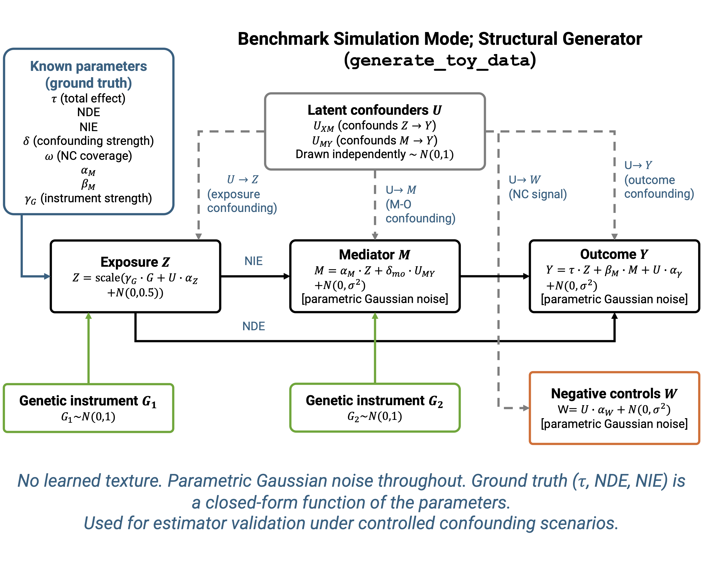
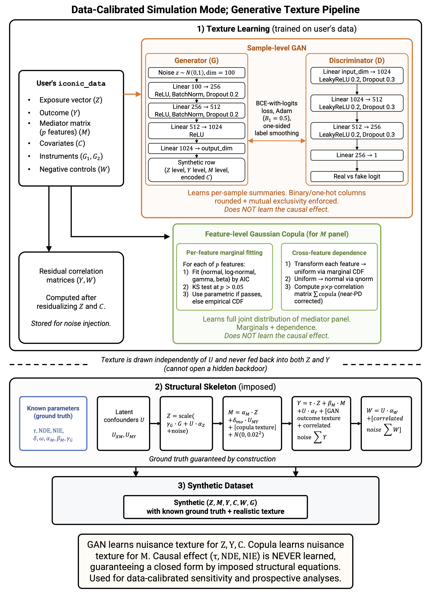

# ICONIC


[](http://www.repostatus.org/#active)
[](https://github.com/sbresnahan/iconic/actions/workflows/R-CMD-check.yaml)
[](https://codecov.io/gh/sbresnahan/iconic)

## About the Package

The R package `iconic` provides a model selection workflow for causal
inference with genetic instruments and negative controls in observational
omics data. It fits eight estimators of the natural direct and indirect
effects (NDE / NIE), diagnoses which are valid for the user's data,
stress-tests them against confounding and pleiotropy violations, and
recommends the one most likely to be unbiased.

The motivating application is estimating the causal effect of an exposure
(e.g. gestational diabetes mellitus) on a panel of molecular outcomes
(e.g. placental transcriptome), but the package is applicable to any
observational study with a genetic instrument, negative controls, and a
mediator and/or outcome panel. A hybrid generative texture model (a torch
GAN for sample-level structure and a Gaussian copula for the mediator
panel) lets the sensitivity analysis mirror the marginal and joint
structure of the user's cohort. Time-to-event outcomes are supported on
the Cox log-hazard-ratio and restricted-mean-survival-time scales.

See the package vignettes for a quickstart guide, an overview of each
functional area, and worked examples.

We welcome your feedback and questions:

- Email <stbresnahan@mdanderson.org> for general questions

## Estimators

`iconic` implements eight estimators of the total effect and its
decomposition into the natural direct and indirect effects. Each estimator
requires different identifying assumptions; `iconic_diagnose()` checks
which are met for your data.

### Total-effect estimators

- **UNADJ** (confounded reference): OLS of $Y$ on $Z + C$. No identifying
  assumption; biased by unmeasured confounding. Serves as the bias
  reference.
- **DIRECT**: OLS of $Y$ on $Z + G_1 + W + C$. Uses all observables but
  does not remove unmeasured confounding; structurally biased.
- **COCA** (Control Outcome Calibration Approach): regresses $W$ on
  $Y + Z + C$ and recovers $\hat{\tau} = -\hat{\beta}_Z / \hat{\beta}_Y$.
  Efficient when $W$ is a strong proxy of $U$; unstable when
  $|\hat{\beta}_Y| \approx 0$. Incompatible with survival outcomes.
- **IV2SLS** (two-stage least squares): instruments $Z$ with $G_1$ in the
  first stage, then regresses $Y$ on $\hat{Z} + C$. Requires a valid
  instrument ($G_1 \perp U$, partial $F \geq 10$).
- **PGC** (proximal g-computation): three-stage estimator that builds a
  bridge $\hat{W}$ from the negative controls and includes it in the
  outcome regression. Requires negative-control completeness
  ($\dim(W_\text{valid}) \geq k$).

### Mediation-specific estimators

These estimators decompose the total effect into NDE and NIE
($\text{NIE} = \hat{\alpha}_M \hat{\beta}_M$) and require either a
mediator instrument ($G_m$) or path-specific negative controls
($W_1$, $W_2$).

- **IV2SLS2** (two-stage MR): three sequential 2SLS stages instrumenting
  both $Z$ (with $G_1$) and $M$ (with $G_m$). Requires both $G_1$ and
  $G_m$ valid with partial $F \geq 10$.
- **PGC2** (two-stage proximal mediation): builds path-specific bridges
  $\hat{W}_1$ (for $U_{XM}$) and $\hat{W}_2$ (for $U_{MY}$) from
  path-specific negative controls. Requires completeness at both stages.
- **PGC2Gm** (negative-control-augmented): combines the $W_1$ bridge with
  a $G_m$-instrumented mediator. Requires both path-specific NCs and a
  mediator instrument; residual bias from $G_m \not\perp U_{MY}$ is
  smaller than IV2SLS2 but nonzero.

### Supported data types and functionalities

| | UNADJ | DIRECT | COCA | IV2SLS | PGC | IV2SLS2 | PGC2 | PGC2Gm |
|---|:---:|:---:|:---:|:---:|:---:|:---:|:---:|:---:|
| Continuous Y | ✓ | ✓ | ✓ | ✓ | ✓ | ✓ | ✓ | ✓ |
| Survival Y | ✓ | ✓ | ✗ | ✓ | ✓ | ✓ | ✓ | ✓ |
| Total effect (τ) | ✓ | ✓ | ✓ | ✓ | ✓ | ✓ | ✓ | ✓ |
| Mediation (NDE + NIE) | ✓ | ✓ | ✓ | ✓ | ✓ | ✓ | ✓ | ✓ |
| Requires $G_1$ | ✗ | ✗ | ✗ | ✓ | ✗ | ✓ | ✗ | ✗ |
| Requires $G_m$ | ✗ | ✗ | ✗ | ✗ | ✗ | ✓ | ✗ | ✓ |
| Requires NCs ($W$) | ✗ | ✓ | ✓ | ✗ | ✓ | ✗ | ✓ | ✓ |
| Requires completeness | ✗ | ✗ | ✗ | ✗ | ✓ | ✗ | ✓ | ✓ |

## Benchmark simulation mode

`generate_toy_data()` implements a structural data-generating process with
parametric Gaussian noise and no learned texture. The ground truth (NDE,
NIE, confounding strength, instrument strength, NC coverage) is a
closed-form function of the parameters, making it suitable for estimator
validation under controlled confounding scenarios.



**Benchmark simulation mode: the structural synthetic-data generator
(`generate_toy_data`).** Latent confounders $U_{XM}$ (opening the
$Z \rightarrow M$ backdoor) and $U_{MY}$ (opening the $M \rightarrow Y$
backdoor) are drawn independently. The exposure $Z$, mediator $M$, and
outcome $Y$ are generated from the structural causal model with parametric
Gaussian noise at every stage. Genetic instruments $G_1$ (for $Z$) and
$G_2$ (for $M$) are drawn as $\mathcal{N}(0, 1)$, and the path-specific
negative controls $W$ are generated as coverage-weighted functions of the
confounders plus noise. All ground-truth quantities are fixed, tunable
parameters.

## Generative texture pipeline

For sensitivity and prospective analyses, ICONIC trains a hybrid
generative texture model on the user's own data so that the synthetic data
mirror the marginal and joint structure of the user's cohort. The model
combines a sample-level GAN (for mixed continuous and categorical
covariate structure) with a feature-level Gaussian copula (for the
mediator panel's marginals and cross-feature dependence). Neither
component learns the causal effect; the ground truth is imposed by the
structural skeleton and guaranteed by construction.



**Data-calibrated simulation mode: the hybrid GAN-plus-copula generative
texture pipeline.** (1) Texture learning: a sample-level GAN and a
feature-level Gaussian copula are trained independently on the user's
data. (2) Structural skeleton: the learned texture is injected into the
structural causal model, drawn independently of the latent confounders.
(3) Synthetic dataset: the result is a synthetic $(Z, M, Y, C, G, W)$
dataset with realistic data texture and known ground truth.

## Installation

```r
# From CRAN (once accepted):
install.packages("iconic")

# From GitHub:
# install.packages("remotes")
remotes::install_github("sbresnahan/iconic")

# The generative texture model (GAN) requires torch:
install.packages("torch")
```

## Quick start

```r
library(iconic)
set.seed(1)

# Simulated mediation panel: exposure Z, mediator M, outcome Y,
# genetic instrument G, negative controls W.
dat <- generate_toy_data(n = 200, n_features = 10, seed = 1)
idat <- iconic_data(
  Z = dat$Z, Y = dat$Y, M = dat$M,
  G = dat$G, W = dat$W, covariates = dat$synthetic_data
)

# 1. Diagnose which estimators are eligible.
diag <- iconic_diagnose(idat)

# 2. Estimate NDE/NIE with all eligible estimators.
est <- iconic_estimate(idat)

# 3. Train a texture model once and attach it (reused downstream).
input <- load_real_input_data(
  Z_matrix = matrix(dat$Z, nrow = 1), Y_matrix = t(dat$Y),
  M_matrix = t(dat$M), W_matrix = t(dat$W),
  covariates_df = dat$synthetic_data
)
idat$trained_gan <- train_gan_on_real_data(
  input$gan_training_data,
  feature_correlations = input$feature_correlations,
  feature_texture = input$feature_texture,
  epochs = 100, seed = 1
)

# 4. Stress-test robustness (reuses the attached GAN).
sens <- iconic_sensitivity(idat, confounding = "inferred")

# 5. Recommend a single estimator.
rec <- iconic_recommend(idat, diag, est, sens)

# 6. Prospect for future studies (reuses the attached GAN).
pros <- iconic_prospect(idat, confounding = "inferred")
```

## Key functions

| Function | Purpose |
|---|---|
| `iconic_data()` | Standardize exposure, outcome, mediator, instruments, and negative controls into one object. |
| `iconic_diagnose()` | Report instrument strength, negative-control validity (A1, A2, A2'), completeness, and estimator eligibility. |
| `iconic_estimate()` | Fit all eligible estimators; return per-feature NDE, NIE, SE, p-value. |
| `train_gan_on_real_data()` | Train a hybrid GAN + copula texture model from your data. |
| `iconic_sensitivity()` | Sweep instrument exogeneity; report bias degradation and tipping points. |
| `infer_confounding()` | Estimate confounding strength, NC coverage, and latent confounder count from the data. |
| `iconic_recommend()` | Combine eligibility, estimates, and robustness into a ranked recommendation. |
| `iconic_prospect()` | Sweep instrument strength to plan future studies. |
| `generate_toy_data()` | Simulate a mediation panel with known ground truth. |

## Vignettes

- **ICONIC Walkthrough**: `vignette("iconic-walkthrough")` — the full
  model-selection workflow end to end.
- **Diagnosing Estimator Eligibility**: `vignette("iconic-diagnose")` —
  instrument strength, negative-control validity screens, completeness,
  and the eligibility table.
- **Sensitivity Analysis and Confounding Inference**:
  `vignette("iconic-sensitivity")` — sweeping instrument exogeneity,
  tipping points, and inferring confounding parameters from data.
- **The Generative Texture Model**: `vignette("iconic-texture-model")` —
  the hybrid GAN + copula architecture, training, and when to use each
  simulation mode.
- **Survival Outcomes**: `vignette("iconic-survival")` — Cox log-HR and
  RMST effect scales, COCA incompatibility, and the 2SPS architecture.

## Citation

Cite the accompanying manuscript (in preparation):

> Bresnahan ST, Xiong C, et al. ICONIC: an R package for negative-control
> and genetic-instrument causal inference and mediation diagnostics in
> observational omics studies.

## License

MIT (c) Sean T. Bresnahan and Charis Xiong.
